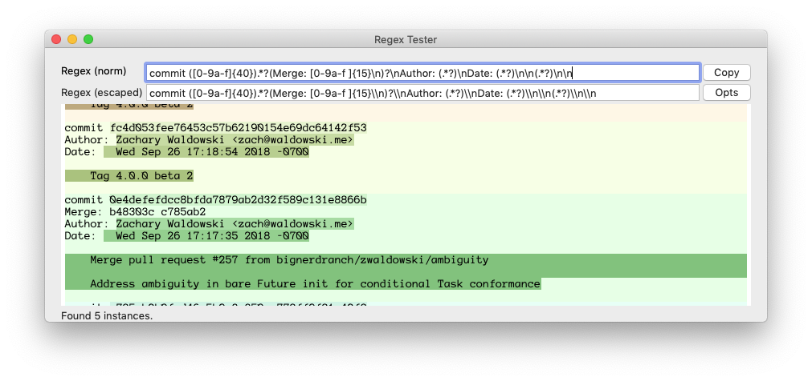

# RegexTester
A simple Mac app for making Swift regex patterns.



The `opts` button allows you to toggle all the options in the `NSRegularExpression.Options` option set, and `copy` produces:

```
let regex = try? NSRegularExpression(pattern: "commit ([0-9a-f]{40}).*?(Merge: [0-9a-f ]{15}\\n)?\\nAuthor: (.*?)\\nDate: (.*?)\\n\\n(.*?)\\n\\n", options: [.dotMatchesLineSeparators])
```

which you can paste into your code and mod at will.*

### Attribution

Written by Steve Sparks ([@barbecuesteve](http://www.barbecuesteve.com/)), 
engineer at [Big Nerd Ranch](https://www.bignerdranch.com/). Screenshot shows a portion of the git log of BNR's [Deferred](https://github.com/bignerdranch/Deferred) library.

### Contributing

Please do! Open a pull request.

--

*Personally I do it this way. It is more maintainable.

```
extension NSRegularExpression {

    enum Regex: String {
        case gitLogEntry = "commit ([0-9a-f]{40}).*?(Merge: [0-9a-f ]{15}\n)?\nAuthor: (.*?)\nDate: (.*?)\n\n(.*?)\n\n"
    }

    convenience init(regex: Regex, options: NSRegularExpression.Options) throws {
        try self.init(pattern: regex.rawValue, options: options)
    }
}

let myRegex = try NSRegularExpression(regex: .gitLogEntry, options: [.dotMatchesLineSeparators])
```
